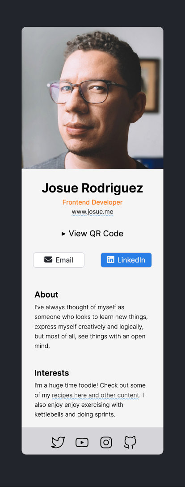

# Scrimba Solo Project - Digital Business Card

## Live Version >> ➡️ [View Here](https://rapidisimo.github.io/digital-business-card/)
[GitHub Repository](https://github.com/Rapidisimo/digital-business-card)

## My Objectives
Fulfill requirements for the project and come up with stretch goals for my self.
Also setup a local environment (VSCode/Vite) and figure out GitHub Actions when pushing changes.

## Requirements
1. ✅ Build from scratch / Follow design spec
2. ✅ Fill in your own information
3. ✅ Separate components for: 
    - ✅ Info(photo, name, buttons, etc.)
    - ✅ About
    - ✅ Interests
    - ✅ Footer (social icons)

## Additional Work Beyond Requirements
1. ✅ Add QR Code for contact information
2. ✅ Add downloadable Vcard from QR Code
3. ✅ Use props to avoid coding hard data.
4. ✅ Use one component (Info.jsx) for both About and Interests sections.
5. ✅ Store data separately to update later from one place (Me.jsx).
6. ✅ Dark mode css based on system or user preference.

### Question/Challenges
1. Was my use of props the correct way to implement them?
2. I had trouble linking assets in the Me.jsx and could only link them when they were in the public folder.
3. In Me.jsx adding an link required me to enclose the string in ```<></>```. Why?
4. In Card.jsx - Is there a better way of having buttons act like links instead of enclosing them in a tags?

## Preview
